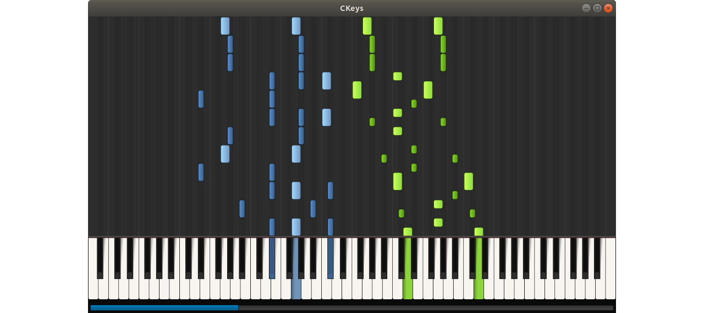
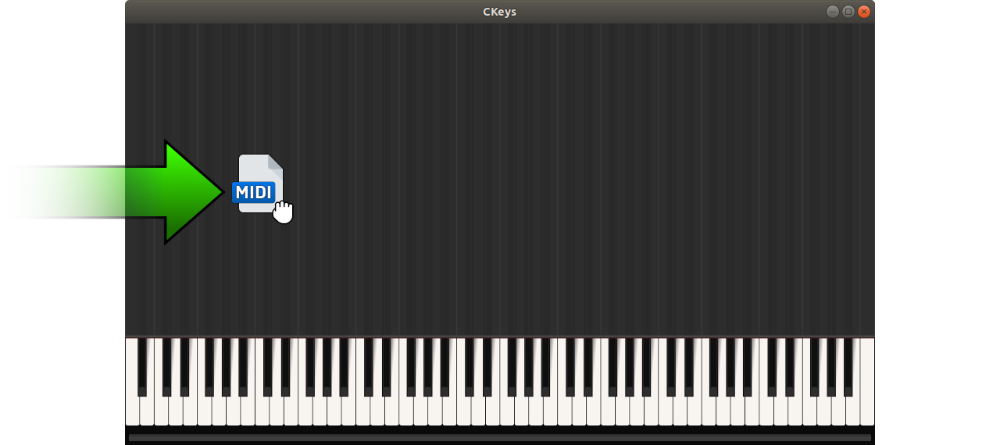
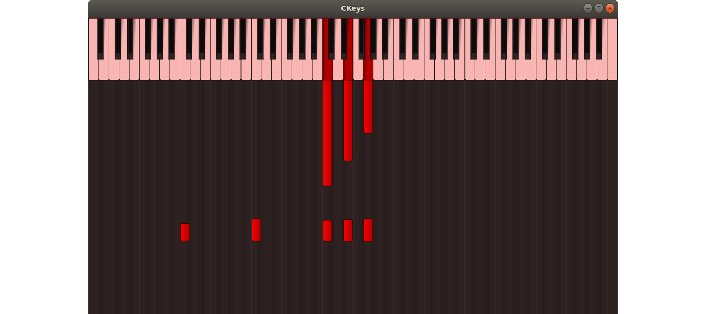

# CKeys

CKeys ("see keys") allows you to visualize the keys for all tracks of a MIDI file on a musical keyboard.
In addition, the notes played can be recorded from a keyboard and saved as a MIDI file.
At the moment there is no GUI and the basic functionalities are accessed via shortcuts.
I wanted to create a simple open source tool that would allow me to quickly capture my own ideas and view them later, while being visually attractive.
Therefore the range of functions is limited at the moment.
The directory structure of this repository is as follows.

| File / Directory   | Description                                       |
| :----------------- | :------------------------------------------------ |
| documentation      | will contain documentation in future              |
| source             | whole source code of CKeys                        |
| LICENSE            | license information                               |
| Makefile           | Makefile used to build CKeys                      |
| README.md          | this file                                         |


> **Windows**<br>
> On Windows you can either download the latest binary file from [Google Drive](https://drive.google.com/drive/folders/1hHQuc2BRq-ZI48p72_fX2NxdtPCdWu19?usp=sharing) or build the software from the source code yourself using [MSYS2/MinGW64](https://www.msys2.org).

> **Linux**<br>
> On Linux you can build the software yourself.

> **Other OS**<br>
> On other operating systems, you must build the software yourself. If you use a GNU compiler and the GNU make tool, you may be able to use the same Makefile with a few adjustments.

### Revision History
| Date        | Version  | Description                                         |
| :---------- | :------- | :-------------------------------------------------- |
| 2020-06-10  | 1.0      | Initial release                                     |
| 2020-09-27  | 1.1      | Improved visualization for missing note off events  |




## How To Use
CKeys is a single executable file.
It does not need to be installed and contains everything it needs.
In case you wonder why it is so large: it is due to the included Fluid (R3) General Midi SoundFont (GM), which provides a large GM sound collection and is about 98% of the binary file size.
CKeys can be operated in two modes: **Performance** and **Recording**.
You can use the shortcuts `CTRL + P` and `CTRL + R` to switch between performance and recording modes, respectively.


### Performance Mode
This is the default operating mode.
Drag and drop a single MIDI file to load it into CKeys.
Use the `SPACE` bar to play or pause.
At the bottom there is a progress bar that shows the current time of the performance.
You can use the left mouse button to move the time.
Alternatively, the key view can also be moved with the left mouse button.
During the cursor movement the playback is paused.
At the moment, CKeys uses the audio device that is the default audio device when the program starts.




### Recording Mode
Most pianos can be connected to the PC via USB.
With a proper driver the piano will be detected as a MIDI device.
Use the `SPACE` bar to start or stop the recording.
If a MIDI device is found, the window will be colored red and the recording will be active, as shown in the picture.
Currently, the default MIDI device is always used.
However, the actual recording only starts when the first MIDI message is received.
To save a recording, press `CTRL + S`.
The recording is saved in the same directory as the application.
The file name is generated using the current UTC time and has the format `RecordingYYYYMMDDhhmmss.mid`, where
`YYYY`, `MM`, `DD`, `hh`, `mm` and `ss` denote year, month, day, hour, minute and second, respectively.
Currently, the acoustic grand piano is set as the default instrument when saving recordings.




## How To Build
At the moment I have less time to deal with build tools like CMake or Automake.
Maybe somebody has time and wants to help me.
At the moment you need the GNU make tool and a GNU compiler that supports the C++17 standard.
If your header files for required libraries are in a different location than mine, you can change this in `/source/precompiled/Common.hpp`.
If the corresponding libraries to be linked against are named differently, you can change this in the `Makefile` on line 30 (Windows) or 31 (Linux).

### External libraries required
Some third-party source code files are already present in the source directory. These include
[NanoVG](https://github.com/memononen/nanovg), [NanoGUI](https://github.com/wjakob/nanogui) and [TinySoundFount](https://github.com/schellingb/TinySoundFont).
Currently NanoVG is used for graphical rendering and TinySoundFont for sound rendering.
The current SoundFont is located as a binary file in the directory `/source/thirdparty/TinySoundFont` and is integrated into the application during a build.
Because GitHub limits the file size to 100 MB, the SoundFont is split into two parts.
All other required external libraries are shown in the following table.


| Library                                      | Windows (MSYS2/MinGW64)                               | Linux                                                   | Comment                                          |
| :------------------------------------------- | :---------------------------------------------------- | :------------------------------------------------------ | :----------------------------------------------- |
| [GLFW3](https://github.com/glfw/glfw)        | `pacman -S mingw-w64-x86_64-glfw`                     | `sudo apt install libglfw3-dev`                         | used to create window and OpenGL-context         |
| [GLEW](http://glew.sourceforge.net)          | build from [source](http://glew.sourceforge.net)      | `sudo apt install libglew-dev`                          | OpenGL extension wrangler library                |
| [GLM](https://github.com/g-truc/glm)         | `pacman -S mingw-w64-x86_64-glm`                      | `sudo apt install libglm-dev`                           | OpenGL mathematics                               |
| [Freetype](https://www.freetype.org)         | build from [source](https://www.freetype.org)         | `sudo apt install libfreetype6-dev`                     | required by NanoVG, NanoGUI to use fonts         |
| [Eigen3](https://gitlab.com/libeigen/eigen)  | `pacman -S mingw-w64-x86_64-eigen3`                   | `sudo apt install libeigen3-dev`                        | required by NanoGUI                              |
| [PortAudio](http://www.portaudio.com)        | `pacman -S mingw-w64-x86_64-portaudio`                | `sudo apt install libasound-dev libportaudio-ocaml-dev` | required for playing audio streams               |
| [RtMidi](https://github.com/thestk/rtmidi)   | build from [source](https://github.com/thestk/rtmidi) | build from [source](https://github.com/thestk/rtmidi)   | required for data acquisition from MIDI devices  |

### Build procedure
The Makefile is designed to work with the default GNU compiler (GCC) under Linux and the MinGW toolchain under Windows.

**Prepare**<br>
You can use the following command to clean up before a rebuilding:
```
make clean
```
The source directory contains a directory called `/source/precompiled`.
All headers that appear within this directory are automatically included during the compilation process.
In this way external headers only need to be included once.
To speed up compilation, all headers within that directory can be precompiled with the command:
```
make pch
```
This command creates precompiled headers in the same source directory (with the file extension *.gch).
Note that these precompiled headers are also deleted when `make clean` is called.
The precompiled headers need to be generated only once.
Additionally, a build directory is created that contains all object and dependency files when compiling.


**Compile and link**<br>
Use the command
```
make
```
to compile all sources and link them together to the final software product.
The final product is written to the same directory where the Makefile is located.
If you have made changes to some code files and recompiled them with `make`, only the sources affected by these changes will be recompiled.
Be careful when renaming sources or moving them to other directories, because then the build directory is no longer consistent with the source directory, which can lead to errors.
In this case a complete rebuilding is recommended.

